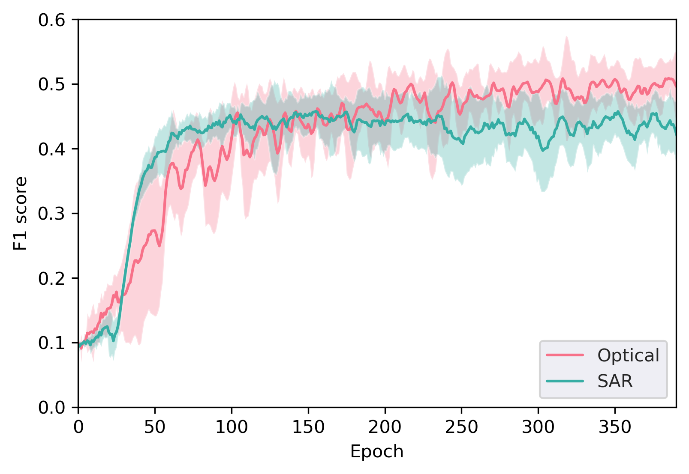
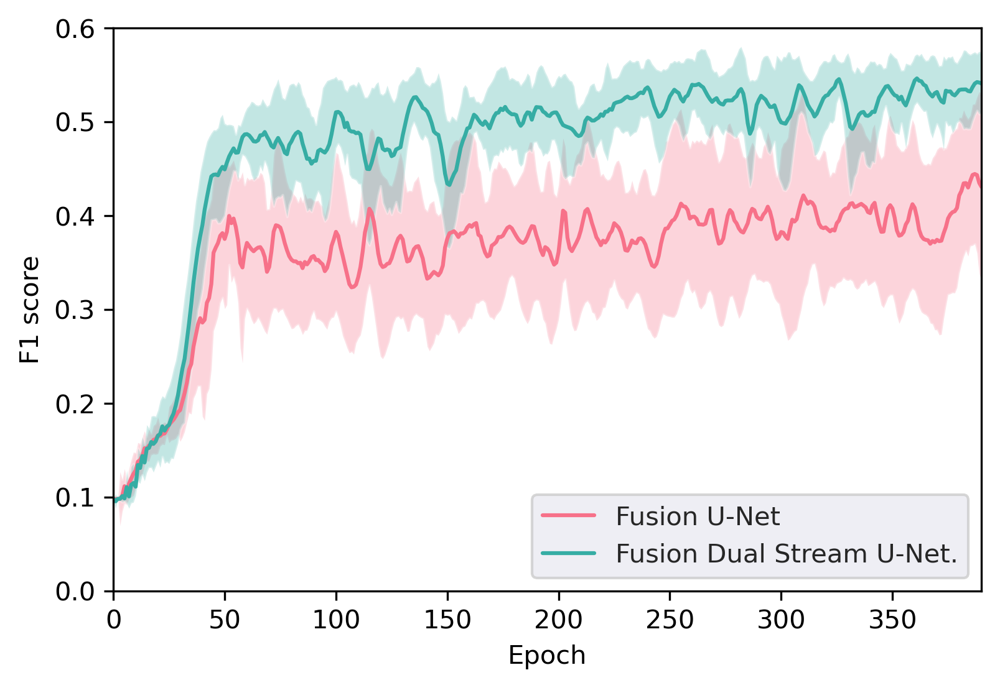

Code of the following manuscript:

'Sentinel-1 and Sentinel-2 Data Fusion for Change Detection using a Dual Stream U-Net'

# 1 Introduction

Urbanization is progressing rapidly around the world. With sub-weekly revisits at global scale, Sentinel-1 Synthetic Aperture Radar (SAR) and Sentinel-2 Multispectral Imager (MSI) data can play an important role for monitoring urban sprawl to support sustainable development. In this paper, we proposed an urban Change Detection (CD) approach featuring a new network architecture for the fusion of SAR and optical data. Specifically, a dual stream concept was introduced to process different data modalities separately, before combining extracted features at a later decision stage. The individual streams are based on U-Net architecture which is one of the most popular fully convolutional networks used for semantic segmentation. The effectiveness of the proposed approach was demonstrated using the Onera Satellite CD (OSCD) dataset. The proposed strategy outperformed other U-Net based approaches in combination with unimodal data and multimodal data with feature level fusion. Furthermore, our approach achieved state-of-the-art performance on the urban CD problem posed by the OSCD dataset.

## 1.1 Network Architecture

Our U-Net             |  Our Dual Stream U-Net
:--------------------:|:-----------------------:
 |  

## 1.2 Sentinel-1 Data

Sentinel-1 image t1             |  Sentinel-1 image t2 |  OSCD change label
:--------------------:|:-------------------------: |:-------------------------:
 |  |  

## 1.3 Experimental Results

Optical vs. SAR           |  U-Net vs. Dual Stream U-Net
:--------------------:|:-----------------------:
 |  

# 2. Installation
## 2.1 Download data

The Sentinel-1 SAR data used to enrich the OSCD dataset is available in the data folder. Alternatively, it can be downloaded
from Google Earth Engine by running the jupyter notebook file sentinel1_download.ipynb.

## 2. Preprocessing

Use preprocess.py to preprocess the images of the OSCD dataset.

## 3. Start the training process with main.py

## 4. Make predictions on the OSCD dataset's testing images with inference.py

# Credits

If you find this work useful, please consider citing:
