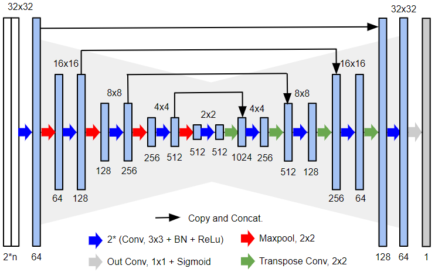
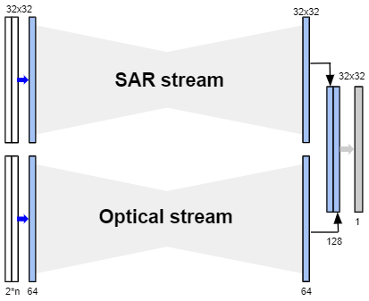
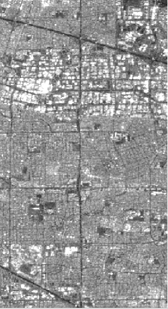
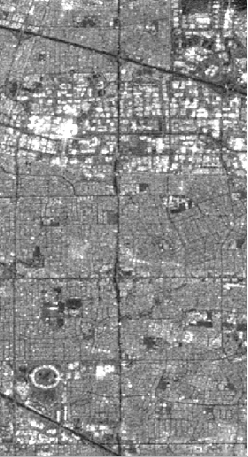
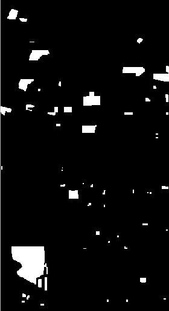

Code of the following letter:

S. Hafner, A. Nascetti, H. Azizpour and Y. Ban, "Sentinel-1 and Sentinel-2 Data Fusion for Urban Change Detection using a Dual Stream U-Net," in *IEEE Geoscience and Remote Sensing Letters*, doi: 10.1109/LGRS.2021.3119856.

[[letter]](https://ieeexplore.ieee.org/document/9570476)

# Abstract

Urbanization is progressing rapidly around the world. With sub-weekly revisits at global scale, Sentinel-1 Synthetic Aperture Radar (SAR) and Sentinel-2 Multispectral Imager (MSI) data can play an important role for monitoring urban sprawl to support sustainable development. In this paper, we proposed an urban Change Detection (CD) approach featuring a new network architecture for the fusion of SAR and optical data. Specifically, a dual stream concept was introduced to process different data modalities separately, before combining extracted features at a later decision stage. The individual streams are based on U-Net architecture which is one of the most popular fully convolutional networks used for semantic segmentation. The effectiveness of the proposed approach was demonstrated using the Onera Satellite CD (OSCD) dataset. The proposed strategy outperformed other U-Net based approaches in combination with unimodal data and multimodal data with feature level fusion. Furthermore, our approach achieved state-of-the-art performance on the urban CD problem posed by the OSCD dataset.


# Proposed Dual Stream U-Net architecutre

The architecture of the proposed network is shown below. It is composed of two separate network streams with identical architectures. Both streams resemble the U-Net architecture presented in [Ronneberger et al. 2015](https://doi.org/10.1007/978-3-319-24574-4_28). The dual stream concept is used to process the SAR and optical image pair in parallel and then fuse extracted features from both sensors at the final decision stage. This architectural design is intended to address inherent differences between information captured in SAR and optical data by encouraging each stream to learn informative change features from the respective sensor separately, before combining the change features. The Dual Stream U-Net has approximately 30 million trainable parameters.

Our U-Net             |  Our Dual Stream U-Net
:--------------------:|:-----------------------:
 |  


# Experimental Results

With an F1 score of 0.600, the Dual Stream U-Net outperforms the baseline achieved with a U-Net using feature level fusion of SAR and optical data as input by 0.045. These results are also considerably better than the benchmark on the original OSCD dataset (0.579) [[Daudt et al. 2018](https://ieeexplore.ieee.org/abstract/document/8518015)]. Therefore, the proposed network architecture is effective in learning from multimodal data.


| Network | Input | Precision | Recall | F1 score |
| :---: | :---: | :---: | :---: | :---: |
| Siam U-Net [[Daudt et al. 2018]]() | Optical | 0.578 | 0.580 | 0.579 |
| Our U-Net | Fusion | 0.550 | 0.560 | 0.555 |
| Our DS U-Net | Fusion | 0.687 | 0.532 | 0.600 |

# Replicating our results
## 1 Download the OSCD dataset
The Onera Satellite Change Detection, presented in [[Daudt et al. 2018](https://ieeexplore.ieee.org/abstract/document/8518015)], can be downloaded from here:  [OSCD dataset](https://ieee-dataport.org/open-access/oscd-onera-satellite-change-detection#files).

All three files are required:
- Onera Satellite Change Detection dataset - Images
- Onera Satellite Change Detection dataset - Train Labels
- Onera Satellite Change Detection dataset - Test Labels

## 2 Download our Sentinel-1 SAR data
  
The Sentinel-1 SAR data used to enrich the OSCD dataset is available in the folder 'data' of this repo. Alternatively, the SAR data can be downloaded
from [Google Earth Engine](https://earthengine.google.com/) by running the jupyter notebook file sentinel1_download.ipynb.

Sentinel-1 image t1             |  Sentinel-1 image t2 |  OSCD change label
:--------------------:|:-------------------------: |:-------------------------:
 |  |  


## 3 Set up paths and preprocess dataset

First we need to set up the paths to our data in the paths.yaml file.

1. Set the OSCD_ROOT variable to the root directory of the OSCD dataset:
     * OSCD_ROOT
       * images (Onera Satellite Change Detection dataset - Images)
       * train_labels (Onera Satellite Change Detection dataset - Train Labels)
       * test_labels (Onera Satellite Change Detection dataset - Test Labels)

2. Set the SENTINEL1_DATA variable to the directory containing our Sentinel-1 SAR data.

3. Set the PREPROCESSED_ROOT variable to an empty directory. All data of the preprocessed dataset will be saved in this directory and accessed for training and inference.

Then we can run preprocess.py.

## 4 Train the network

Run train_network.py with any of the configs (e.g. python train_network.py -c fusion_1)

## 5 Model evaluation

The file evaluation.py contains a collection of functions to quantitatively and qualitatively assess network performance.

# Credits

If you find this work useful, please consider citing:


  ```bibtex
    @ARTICLE{9570476,
      author={Hafner, Sebastian and Nascetti, Andrea and Azizpour, Hossein and Ban, Yifang},
      journal={IEEE Geoscience and Remote Sensing Letters}, 
      title={Sentinel-1 and Sentinel-2 Data Fusion for Urban Change Detection using a Dual Stream U-Net}, 
      year={2021},
      volume={},
      number={},
      pages={1-1},
      doi={10.1109/LGRS.2021.3119856}}
  ```
  